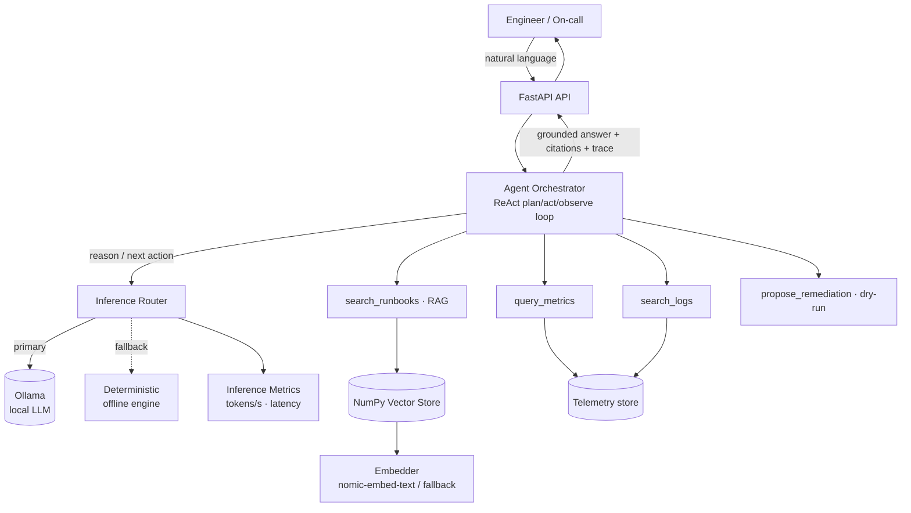

# 🛰️ InferOps — A Local-Inference DevOps Copilot (RAG + Autonomous Agents)

> An open, self-hostable **SRE copilot** that triages production incidents with
> **local LLM inference**, **Retrieval-Augmented Generation (RAG)** over your
> runbooks, and an **autonomous tool-calling agent** — with first-class
> **inference observability** (tokens/sec, latency, backend mix).

<p align="center">
  
  
  
  
  
  
</p>

---

## The problem

When a service is on fire at 3 a.m., engineers burn precious minutes context-switching
between dashboards, log search, and a wiki full of runbooks. The knowledge to fix the
incident *already exists* — it's just scattered and slow to assemble.

**InferOps** compresses that loop. Ask in plain English; an agent **gathers the
evidence** (metrics + logs), **retrieves the right runbook** with RAG, and proposes a
**grounded, dry-run remediation plan** — all running on **infrastructure you control**.

## Why local inference?

This project deliberately centers **AI inference** as a first-class concern:

- **Data stays in your VPC.** Logs and metrics never leave your network — they're fed
  to a **locally hosted model** (Ollama when available, with a deterministic offline fallback).
- **Cost & latency control.** No per-token cloud bills; you own the latency budget.
- **Inference observability.** Every response ships with **tokens/sec, latency, token
  counts, model and backend** so you can reason about cost and performance — exposed at
  `GET /api/v1/inference/metrics`.
- **Runs anywhere.** A deterministic **offline fallback engine** keeps the whole app
  functional with **zero GPU and zero external services** (great for CI, laptops, and demos).

---

## Architecture



### The two workflows

| Mode | What it does | Best for |
|------|--------------|----------|
| **`agent`** | Autonomous **plan → act → observe** loop. Calls tools to gather metrics & logs, runs **RAG** over runbooks, and proposes a dry-run fix. | Incident triage |
| **`rag`** | Single-shot **grounded Q&A** over the runbook knowledge base with inline `[n]` citations. | "How do I…?" questions |

---

## Key AI concepts demonstrated

- **AI Inference** — pluggable backend (`OllamaClient`) with an `InferenceRouter` that
  records per-call telemetry and degrades gracefully.
- **RAG** — chunking → embeddings → cosine retrieval → grounded prompt with **citations**.
- **Agents** — a model-agnostic **ReAct** loop with a strict **JSON tool-calling protocol**
  (`query_metrics`, `search_logs`, `search_runbooks`, `propose_remediation`).
- **Guardrails** — remediation is **DRY-RUN only**; the agent never executes commands.
- **Observability** — inference metrics endpoint + structured agent reasoning traces.

---

## Quickstart

### Option A — Run instantly (no GPU, no Ollama)
The deterministic fallback engine makes InferOps runnable out of the box.

```bash
python -m venv .venv
.venv\Scripts\activate          # Windows  (use: source .venv/bin/activate on macOS/Linux)
pip install -r requirements.txt

# end-to-end terminal demo
python -m scripts.demo

# or start the API + web UI
uvicorn app.main:app --reload --port 8000
# open http://localhost:8000
```

### Option B — Real local inference with Ollama
```bash
# 1. Install Ollama  →  https://ollama.com
ollama pull llama3.1
ollama pull nomic-embed-text

# 2. Point InferOps at it (defaults already match)
copy .env.example .env          # set ENABLE_OLLAMA=true
uvicorn app.main:app --port 8000
```

### Option C — Docker Compose (API + Ollama)
```bash
docker compose up --build
# API on :8000, Ollama on :11434
```

---

## 🔌 API

```bash
# Autonomous incident triage
curl -s http://localhost:8000/api/v1/chat -H "Content-Type: application/json" -d '{
  "query": "checkout-api p99 latency is spiking and pods keep restarting",
  "mode": "agent",
  "service": "checkout-api"
}'

# Grounded Q&A (RAG)
curl -s http://localhost:8000/api/v1/chat -H "Content-Type: application/json" -d '{
  "query": "how do I fix disk pressure / no space left on device?",
  "mode": "rag"
}'

# Inference telemetry
curl -s http://localhost:8000/api/v1/inference/metrics
```

| Method | Path | Description |
|--------|------|-------------|
| `GET` | `/health` | Status + active inference backend + index size |
| `POST` | `/api/v1/chat` | Agent triage or RAG Q&A |
| `POST` | `/api/v1/ingest` | (Re)index the runbook knowledge base |
| `GET` | `/api/v1/inference/metrics` | Aggregate tokens, latency, backend mix |
| `GET` | `/docs` | Interactive OpenAPI docs |

---

## Sample agent trace

```text
AGENT MODE · autonomous incident triage
Query   : checkout-api p99 latency is spiking and pods keep restarting
Service : checkout-api

Step 1: query_metrics(checkout-api)
        → cpu 93.5% · memory 96.2% · p99 2150ms · errors 8.7% · restarts/1h 7
Step 2: search_logs(checkout-api)
        → ERROR OOMKilled ... exceeded memory limit 512Mi ; reason=CrashLoopBackOff
Step 3: search_runbooks(<symptoms + evidence>)        # RAG
        → top match: pod_crashloop_oomkill.md (score 0.28)
Step 4: propose_remediation(<diagnosis>)              # dry-run, grounded

FINAL ANSWER
Root cause (likely): memory exhaustion / OOMKill driving CrashLoopBackOff on checkout-api.
Key metrics — cpu 93.5, memory 96.2, p99 2150, errors 8.7, restarts/1h 7
Recommended remediation (DRY-RUN — review before applying):
  $ kubectl set resources deployment/<name> --limits=memory=1Gi --requests=memory=768Mi
  $ kubectl scale deployment/<name> --replicas=5
  $ kubectl rollout undo deployment/<name>
Sources: pod_crashloop_oomkill.md
```

---

## Project structure

```
app/
├── inference/        # AI inference: Ollama client, offline fallback, router, metrics
├── rag/              # chunking, embeddings, NumPy vector store, retriever
├── agents/           # ReAct orchestrator + incident-response tools
├── telemetry/        # mock observability backend (metrics/logs) + logging
├── api/              # FastAPI routes (chat, ingest, health/metrics)
├── models/           # Pydantic schemas
└── services.py       # wiring + the two product workflows
data/
├── runbooks/         # 5 SRE runbooks (the RAG knowledge base)
└── sample_telemetry/ # mock metrics & logs for 3 services
ui/                   # single-page web console
scripts/              # demo.py · ingest.py
tests/                # inference · rag · agents
```

---

## Tech stack

**Python · FastAPI · Pydantic · httpx · NumPy** · **Ollama** (local inference) · deterministic offline fallback
· **nomic-embed-text** embeddings · Docker.

> Deliberately **dependency-light**: the vector store is pure NumPy so the project runs
> with no external vector DB. The `add_texts` / `search` interface is a drop-in seam for
> FAISS, Chroma, or pgvector in production.

## 🧭 Roadmap

- [ ] Token **streaming** (SSE) with live tokens/sec in the UI
- [ ] **vLLM** backend for high-throughput batched inference
- [ ] Real connectors: Prometheus, Loki/Elasticsearch, Kubernetes API
- [ ] **Model routing** (small fast model for planning, larger for synthesis)
- [ ] Eval harness for retrieval quality & answer faithfulness

## Run the tests
```bash
pytest
```

*Built as a portfolio project to demonstrate practical **AI inference**, **RAG**, and
**agentic** system design. The telemetry and runbooks are illustrative samples; swap in
real connectors to productionize.*
